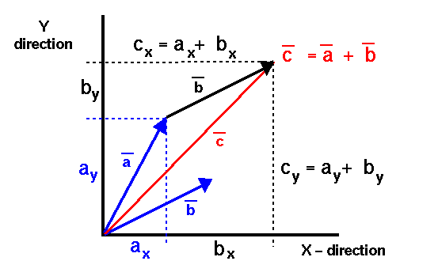

# III. Les Vecteurs

Dans la section précédente, nous avons étudié les scalaires, des quantités définies dans l'ensemble \( \mathbb{R} \), (un espace à une dimension). 

**Problème !** Notre monde est en trois dimensions. Pour décrire des phénomènes physiques de manière réaliste, nous avons besoin d'objets mathématiques capables de représenter des propriétés multidimensionnelles. Les **vecteurs** répondent à ce besoin en nous permettant de décrire une **direction**, un **sens**, et une **intensité** (ou **magnitude**).

## 1. Définition et Propriétés des Vecteurs

Un **vecteur** est un objet mathématique possédant les trois caractéristiques suivantes :

1. **Direction** : Géométriquement, la direction d'un vecteur correspond à la droite qui le porte. 
2. **Sens** : Le vecteur a un sens représenté par la flèche de sa ligne, qui pointe dans une direction précise le long de sa droite.
3. **Intensité (ou Norme)** : La longueur d’un vecteur, notée souvent \( V \), \( |\vec{V}| \) ou \( ||\vec{V}|| \), représente son **intensité** ou **norme**. Elle exprime la grandeur de la quantité mesurée, comme une distance, une vitesse, ou une force.

La norme d’un vecteur est une grandeur scalaire, c’est-à-dire une quantité avec une unité. Par exemple, un vecteur vitesse aura une norme en m/s, tandis qu'un vecteur distance sera en mètres.

En plus de ces propriétés, un vecteur possède un **point d'origine** (ou **point d'application**) qui détermine où le vecteur commence.

Les vecteurs peuvent également être classifiés selon leur point d'application :

- **Vecteurs glissants** : Ces vecteurs peuvent être appliqués en n'importe quel point le long d'une ligne d'action imposée. Par exemple, la force appliquée sur une barre est souvent considérée comme un vecteur glissant.
- **Vecteurs liés (ou "pointeurs")** : Ces vecteurs ont un point d'application fixe. Ils sont souvent utilisés pour représenter des forces appliquées à un point spécifique, comme la force exercée sur un objet en un endroit précis.

!!! tip "Les tips de top-top"
    Lorsque vous travaillez avec des vecteurs, assurez-vous de toujours spécifier leur point d'origine et leur sens, surtout en mécanique, où ces détails influencent directement le comportement du système. La translation d'un objet peut être décrite par un vecteur glissant. La position de l'objet en revanche est décrite par un vecteur lié à l'origine. Lors de la translation, le vecteur position sera déplacé. Mais peut importe le point ou l'on applique le vecteur translation. Nous verrons plus loin que ces transformations peuvent être décrite pas des objets mathématiques plus avancées : les tenseurs

## 2. Opérations sur les Vecteurs

Les vecteurs peuvent être manipulés à l’aide d’opérations de base qui permettent d'analyser et de combiner des mouvements et des forces. Voici les opérations principales :

### 2.1 Addition de Vecteurs

L’**addition** de deux vecteurs est une opération qui permet de combiner leurs effets. Si l’on considère deux vecteurs \( \vec{A} \) et \( \vec{B} \), la somme \( \vec{A} + \vec{B} \) est un vecteur obtenu en plaçant l’origine de \( \vec{B} \) à l’extrémité de \( \vec{A} \). Graphiquement, cela revient à former un triangle ou un parallélogramme, selon la disposition des vecteurs.

{.center}

source : NASA

### 2.2 Multiplication d'un Vecteur par un Scalaire

La **multiplication** d’un vecteur par un scalaire \( \alpha \) modifie sa norme sans changer sa direction. Par exemple, si \( \vec{V} \) représente un vecteur vitesse, alors \( 2 \vec{V} \) représente un vecteur vitesse deux fois plus rapide mais dans la même direction.

### 2.3 Produit Scalaire (Dot Product)

Le **produit scalaire** entre deux vecteurs \( \vec{A} \) et \( \vec{B} \), noté \( \vec{A} \cdot \vec{B} \), est une opération qui produit un scalaire. Il est défini par :

\[
\vec{A} \cdot \vec{B} = ||\vec{A}|| \times ||\vec{B}|| \times \cos(\theta)
\]

où \( \theta \) est l'angle entre \( \vec{A} \) et \( \vec{B} \). Le produit scalaire est utilisé pour mesurer l'alignement entre deux vecteurs, et il est particulièrement utile pour calculer des travaux en physique.

### 2.4 Produit Vectoriel (Cross Product)

Le **produit vectoriel** entre deux vecteurs \( \vec{A} \) et \( \vec{B} \), noté \( \vec{A} \times \vec{B} \), produit un vecteur perpendiculaire aux deux vecteurs d'origine. Sa norme est donnée par :

\[
||\vec{A} \times \vec{B}|| = ||\vec{A}|| \times ||\vec{B}|| \times \sin(\theta)
\]

!!! quote "In english please"
    The cross product of two vectors create a new vector perpendicular to the two original vectors.

Ce produit est souvent utilisé en physique pour calculer des forces dans des situations où les vecteurs sont perpendiculaires, comme pour le couple ou le moment d’une force.

Voici une version améliorée du chapitre sur les vecteurs, adaptée pour des étudiants de niveau Master. Nous conservons la définition pratique tout en approfondissant les concepts et en introduisant une explication mathématique plus formelle en fin de chapitre pour préparer la transition vers les espaces vectoriels.

---

# III. Les Vecteurs

Dans les sections précédentes, nous avons étudié les scalaires, des quantités définies dans l'ensemble \( \mathbb{R} \), c'est-à-dire dans un espace à une dimension. **Problème !** Notre monde est en trois dimensions, et de nombreux phénomènes physiques nécessitent la description de grandeurs ayant non seulement une magnitude, mais aussi une direction et un sens. Les **vecteurs** répondent à ce besoin en fournissant un cadre mathématique pour représenter ces grandeurs multidimensionnelles.

## 1. Définition et Propriétés des Vecteurs

Un **vecteur** est un objet mathématique caractérisé par :

1. **Direction** : La droite selon laquelle le vecteur agit. Géométriquement, c'est l'orientation de la ligne qui porte le vecteur.

2. **Sens** : Le côté de la droite orientée vers lequel pointe le vecteur, représenté par la flèche. Il indique le chemin dans lequel la grandeur agit.

3. **Intensité (ou Norme)** : La grandeur du vecteur, notée \( ||\vec{V}|| \) ou \( |\vec{V}| \), qui correspond à sa longueur géométrique. Cette magnitude est une quantité scalaire positive, souvent associée à une unité physique (par exemple, mètres pour une distance, newtons pour une force).

4. **Point d'Application** : Le point à partir duquel le vecteur agit. Il peut être fixe ou variable selon le type de vecteur considéré.

En physique, les vecteurs sont utilisés pour représenter des grandeurs telles que le déplacement, la vitesse, l'accélération, les forces, etc.

### Types de Vecteurs

- **Vecteurs Liés** : Des vecteurs dont le point d'application est fixé. Ils sont attachés à un point spécifique de l'espace. Par exemple, une force appliquée à un point précis d'un objet.

- **Vecteurs Glissants** : Des vecteurs dont le point d'application peut glisser le long de leur ligne d'action sans affecter les conditions du problème. Par exemple, les forces dans un solide indéformable.

- **Vecteurs Libres** : Des vecteurs sans point d'application spécifique. Ils sont définis uniquement par leur magnitude et leur direction. En mathématiques pures, on considère souvent les vecteurs comme libres.

!!! tip "Conseil"
    Lorsque vous travaillez avec des vecteurs en mécanique, assurez-vous de toujours spécifier le type de vecteur (lié, glissant, libre) pour une modélisation correcte des systèmes physiques. La translation d'un objet peut être décrite par un vecteur glissant. La position de l'objet, en revanche, est décrite par un vecteur lié à l'origine. Lors de la translation, le vecteur position sera déplacé. Mais peu importe le point où l'on applique le vecteur translation. Nous verrons plus loin que ces transformations peuvent être décrites par des objets mathématiques plus avancés : les tenseurs.

### Représentation des Vecteurs

Un vecteur peut être représenté de différentes manières :

- **Représentation Géométrique** : Par une flèche dans l'espace, avec une longueur proportionnelle à la norme du vecteur, une direction et un sens.

- **Coordonnées Cartésiennes** : Dans un espace à \( n \) dimensions, un vecteur est défini par ses composantes selon les axes du système de coordonnées. Par exemple, dans \( \mathbb{R}^3 \), un vecteur \( \vec{V} \) est représenté par :

  \[
  \vec{V} = (V_x, V_y, V_z)
  \]

  où \( V_x \), \( V_y \), et \( V_z \) sont les projections de \( \vec{V} \) sur les axes \( x \), \( y \), et \( z \).

## 2. Opérations sur les Vecteurs

Les vecteurs obéissent à des règles d'opérations spécifiques, qui permettent de les manipuler mathématiquement.

### 2.1 Addition de Vecteurs

L'**addition** de deux vecteurs \( \vec{A} \) et \( \vec{B} \) donne un vecteur résultant \( \vec{C} = \vec{A} + \vec{B} \).

- **Règle du Parallélogramme** : Géométriquement, on place les vecteurs de telle sorte que l'origine de \( \vec{B} \) coïncide avec l'extrémité de \( \vec{A} \). Le vecteur résultant est alors la diagonale du parallélogramme formé.

- **En Coordonnées** : Si \( \vec{A} = (A_x, A_y, A_z) \) et \( \vec{B} = (B_x, B_y, B_z) \), alors :

  \[
  \vec{C} = \vec{A} + \vec{B} = (A_x + B_x, \ A_y + B_y, \ A_z + B_z)
  \]

### 2.2 Soustraction de Vecteurs

La **soustraction** de vecteurs est définie comme l'addition du vecteur opposé :

\[
\vec{A} - \vec{B} = \vec{A} + (-\vec{B})
\]

Où \( -\vec{B} \) est le vecteur opposé de \( \vec{B} \), ayant la même magnitude mais une direction opposée.

### 2.3 Multiplication d'un Vecteur par un Scalaire

La **multiplication** d'un vecteur \( \vec{V} \) par un scalaire \( \alpha \in \mathbb{R} \) produit un vecteur \( \alpha \vec{V} \) dont la magnitude est multipliée par \( |\alpha| \) et dont la direction reste la même si \( \alpha > 0 \) ou est inversée si \( \alpha < 0 \).

### 2.4 Produit Scalaire (Produit Intérieur)

Le **produit scalaire** entre deux vecteurs \( \vec{A} \) et \( \vec{B} \) est une opération qui associe deux vecteurs à un scalaire :

\[
\vec{A} \cdot \vec{B} = ||\vec{A}|| \ ||\vec{B}|| \ \cos(\theta)
\]

Où \( \theta \) est l'angle entre \( \vec{A} \) et \( \vec{B} \). En coordonnées cartésiennes :

\[
\vec{A} \cdot \vec{B} = A_x B_x + A_y B_y + A_z B_z
\]

Le produit scalaire mesure la projection de l'un des vecteurs sur l'autre.

### 2.5 Produit Vectoriel (Produit Extérieur)

Le **produit vectoriel** entre deux vecteurs \( \vec{A} \) et \( \vec{B} \) dans \( \mathbb{R}^3 \) est un vecteur \( \vec{C} = \vec{A} \times \vec{B} \) défini par :

- **Magnitude** :

  \[
  ||\vec{C}|| = ||\vec{A}|| \ ||\vec{B}|| \ \sin(\theta)
  \]

- **Direction** : Orthogonale (perpendiculaire) au plan formé par \( \vec{A} \) et \( \vec{B} \), selon la règle de la main droite.

- **En Coordonnées** :

  \[
  \vec{C} = \vec{A} \times \vec{B} = 
  \begin{vmatrix}
  \vec{i} & \vec{j} & \vec{k} \\
  A_x & A_y & A_z \\
  B_x & B_y & B_z
  \end{vmatrix}
  \]

  Ce déterminant donne :

  \[
  \vec{C} = (A_y B_z - A_z B_y, \ A_z B_x - A_x B_z, \ A_x B_y - A_y B_x)
  \]

Le produit vectoriel est utilisé pour calculer des moments, des couples, et est essentiel en mécanique pour analyser les rotations et les forces perpendiculaires.

## 3. Propriétés Algébriques des Vecteurs

Les vecteurs obéissent à des propriétés algébriques similaires à celles des nombres réels, mais adaptées à leurs caractéristiques multidimensionnelles.

### 3.1 Propriétés de l'Addition

- **Commutativité** : \( \vec{A} + \vec{B} = \vec{B} + \vec{A} \)

- **Associativité** : \( (\vec{A} + \vec{B}) + \vec{C} = \vec{A} + (\vec{B} + \vec{C}) \)

- **Élément Neutre** : Il existe un vecteur nul \( \vec{0} \) tel que \( \vec{A} + \vec{0} = \vec{A} \)

- **Inverse Additif** : Pour tout vecteur \( \vec{A} \), il existe un vecteur \( -\vec{A} \) tel que \( \vec{A} + (-\vec{A}) = \vec{0} \)

### 3.2 Propriétés de la Multiplication par un Scalaire

- **Associativité** : \( (\alpha \beta) \vec{A} = \alpha (\beta \vec{A}) \)

- **Distributivité sur les Vecteurs** : \( \alpha (\vec{A} + \vec{B}) = \alpha \vec{A} + \alpha \vec{B} \)

- **Distributivité sur les Scalaires** : \( (\alpha + \beta) \vec{A} = \alpha \vec{A} + \beta \vec{A} \)

- **Élément Neutre** : \( 1 \vec{A} = \vec{A} \)

Ces propriétés permettent de manipuler les vecteurs de manière algébrique et sont essentielles pour le développement de l'algèbre vectorielle.

## 4. Bases et Composantes des Vecteurs

Dans un espace vectoriel, les vecteurs peuvent être exprimés en termes de **bases**.

### 4.1 Base de l'Espace Vectoriel

Une **base** d'un espace vectoriel \( V \) est un ensemble de vecteurs \( \{\vec{e}_1, \vec{e}_2, \dots, \vec{e}_n\} \) linéairement indépendants qui engendrent \( V \). Tout vecteur \( \vec{V} \in V \) peut être exprimé comme une combinaison linéaire de ces vecteurs :

\[
\vec{V} = v_1 \vec{e}_1 + v_2 \vec{e}_2 + \dots + v_n \vec{e}_n
\]

où \( v_i \in \mathbb{R} \) sont les **composantes** du vecteur \( \vec{V} \) dans la base choisie.

### 4.2 Composantes dans une Base Orthonormée

Dans une base orthonormée (les vecteurs de base sont orthogonaux entre eux et de norme unitaire), les calculs de produits scalaires et de normes sont simplifiés.

- **Produit Scalaire** :

  \[
  \vec{A} \cdot \vec{B} = \sum_{i=1}^{n} A_i B_i
  \]

- **Norme du Vecteur** :

  \[
  ||\vec{A}|| = \sqrt{\vec{A} \cdot \vec{A}} = \sqrt{\sum_{i=1}^{n} A_i^2}
  \]

Cette représentation facilite les calculs algébriques et analytiques en mécanique et en physique.

## 5. Transition vers les Espaces Vectoriels

Jusqu'ici, nous avons considéré les vecteurs comme des flèches dans l'espace, dotées d'une magnitude et d'une direction. Cette approche est très intuitive et utile pour les applications physiques. Cependant, pour approfondir l'étude des vecteurs et généraliser les concepts à des dimensions supérieures ou à des espaces plus abstraits, il est nécessaire d'adopter une perspective plus mathématique.

### 5.1 Définition Mathématique du Vecteur

Mathématiquement, un **vecteur** est un élément d'un **espace vectoriel**. Un espace vectoriel \( V \) sur un corps \( \mathbb{K} \) (par exemple, \( \mathbb{R} \) ou \( \mathbb{C} \)) est un ensemble muni de deux opérations :

1. **Addition** : Une loi interne \( + : V \times V \rightarrow V \) satisfaisant les propriétés d'associativité, de commutativité, d'existence d'un élément neutre (vecteur nul) et d'existence d'inverses.

2. **Multiplication par un Scalaire** : Une loi externe \( \cdot : \mathbb{K} \times V \rightarrow V \) satisfaisant les propriétés de distributivité, d'associativité et d'existence d'un élément neutre multiplicatif.

Les vecteurs ne sont plus seulement des flèches dans l'espace physique, mais des éléments abstraits pouvant représenter des fonctions, des suites, des matrices, etc.

### 5.2 Importance de la Structure d'Espace Vectoriel

Cette définition abstraite permet d'étendre les concepts de l'algèbre vectorielle à des domaines variés :

- **Fonctions comme Vecteurs** : L'ensemble des fonctions continues sur un intervalle forme un espace vectoriel.

- **Matrices comme Vecteurs** : Les matrices de taille fixe peuvent être considérées comme des vecteurs dans un espace vectoriel approprié.

- **Étude des Propriétés Structurelles** : Les notions de sous-espaces, de dimension, de bases, et de transformations linéaires deviennent centrales.

En adoptant cette perspective, nous pouvons exploiter toute la puissance de l'algèbre linéaire pour analyser des systèmes complexes.

---

Dans le chapitre suivant, nous approfondirons la notion d'**espace vectoriel**, en formalisant les concepts introduits ici et en explorant les propriétés fondamentales qui permettent de généraliser les vecteurs à des contextes plus larges. Nous étudierons également les sous-espaces, les bases, les dimensions, et les applications linéaires, qui sont des outils essentiels en mathématiques avancées et en physique théorique.
